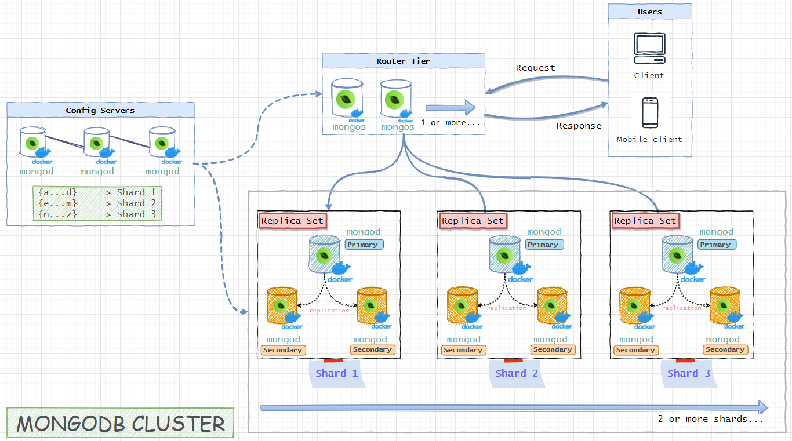

# MongoDB Sharded Cluster with Docker Compose


## Mongo Components

* Config Server (3 member replica set): `configsvr01`,`configsvr02`,`configsvr03`
* 3 Shards (each a 3 member `PSS` replica set):
	* `shard01-a`,`shard01-b`, `shard01-c`
	* `shard02-a`,`shard02-b`, `shard02-c`
	* `shard03-a`,`shard03-b`, `shard03-c`
* 2 Routers (mongos): `router01`, `router02`



## Steps

### Step 1: Start all of the containers

```bash
docker-compose up -d
```

### Step 2: Initialize the replica sets (config servers and shards)

Run these command one by one:

```bash
docker-compose exec configsvr01 sh -c "mongosh < /scripts/init-configserver.js"

docker-compose exec shard01-a sh -c "mongosh < /scripts/init-shard01.js"
docker-compose exec shard02-a sh -c "mongosh < /scripts/init-shard02.js"
docker-compose exec shard03-a sh -c "mongosh < /scripts/init-shard03.js"
```

### Step 3: Initializing the router

>Note: Wait a bit for the config server and shards to elect their primaries before initializing the router

```bash
docker-compose exec router01 sh -c "mongosh < /scripts/init-router.js"
```

#### Step 3.1 Create database and collection

```bash
docker-compose exec router01 mongosh --port 27017

// Create database
use MyDatabase

// Create collection
db.createCollection("MyCollection")
```


### Step 4: Enable sharding and setup sharding-key

```bash
docker-compose exec router01 mongosh --port 27017

// Enable sharding for database `MyDatabase`
// sh.enableSharding("MyDatabase")

// Setup shardingKey for collection `MyCollection`**
db.adminCommand( { shardCollection: "MyDatabase.MyCollection", key: { oemNumber: "hashed", zipCode: 1, supplierId: 1 } } )

```

---
### Done!

Here is mongodb connection string if you want to try to connect mongodb cluster with MongoDB Compass from your host computer:

```
mongodb://127.0.0.1:27117,127.0.0.1:27118
```

---

## Collection and Document Creation

```javascript
// Switch to the database
use testDB;

// Create a new collection
db.createCollection('testCollection2');

// Create an index on the 'name' field
db.testCollection2.createIndex({name: 'hashed'});

// Enable sharding for the collection
sh.shardCollection("testDB.testCollection2", {name: 'hashed'});

// Insert some documents
db.testCollection2.insert({name: 'Tom', age: 18});
db.testCollection2.insert({name: 'Jerry', age: 20});
db.testCollection2.insert({name: 'Jack', age: 22});
db.testCollection2.insert({name: 'Rose', age: 24});
db.testCollection2.insert({name: 'Rosen', age: 15});
```

## Verification of Sharding

### Checking Shard Status

```shell
[mongos] test> sh.status();
```

#### Output:

```plaintext
shardingVersion
{ _id: 1, clusterId: ObjectId('664bc2aabd32b1b9d0a019ca') }
---
shards
[
  {
    _id: 'rs-shard-01',
    host: 'rs-shard-01/shard01-a:27017,shard01-b:27017,shard01-c:27017',
    state: 1,
    topologyTime: Timestamp({ t: 1716241085, i: 6 })
  },
  {
    _id: 'rs-shard-02',
    host: 'rs-shard-02/shard02-a:27017,shard02-b:27017,shard02-c:27017',
    state: 1,
    topologyTime: Timestamp({ t: 1716241085, i: 14 })
  },
  {
    _id: 'rs-shard-03',
    host: 'rs-shard-03/shard03-a:27017,shard03-b:27017,shard03-c:27017',
    state: 1,
    topologyTime: Timestamp({ t: 1716241086, i: 7 })
  }
]
---
active mongoses
[ { '6.0.1': 2 } ]
---
autosplit
{ 'Currently enabled': 'yes' }
---
balancer
{
  'Currently enabled': 'yes',
  'Currently running': 'no',
  'Failed balancer rounds in last 5 attempts': 0,
  'Migration Results for the last 24 hours': { '682': 'Success' }
}
```

### Checking Shard Distribution

```shell
[mongos] testDB> db.testCollection2.getShardDistribution();
```

#### Output:

```plaintext
Shard rs-shard-03 at rs-shard-03/shard03-a:27017,shard03-b:27017,shard03-c:27017
{
  data: '139B',
  docs: 3,
  chunks: 2,
  'estimated data per chunk': '69B',
  'estimated docs per chunk': 1
}
---
Shard rs-shard-01 at rs-shard-01/shard01-a:27017,shard01-b:27017,shard01-c:27017
{
  data: '47B',
  docs: 1,
  chunks: 2,
  'estimated data per chunk': '23B',
  'estimated docs per chunk': 0
}
---
Shard rs-shard-02 at rs-shard-02/shard02-a:27017,shard02-b:27017,shard02-c:27017
{
  data: '45B',
  docs: 1,
  chunks: 2,
  'estimated data per chunk': '22B',
  'estimated docs per chunk': 0
}
---
Totals
{
  data: '231B',
  docs: 5,
  chunks: 6,
  'Shard rs-shard-03': [
    '60.17 % data',
    '60 % docs in cluster',
    '46B avg obj size on shard'
  ],
  'Shard rs-shard-01': [
    '20.34 % data',
    '20 % docs in cluster',
    '47B avg obj size on shard'
  ],
  'Shard rs-shard-02': [
    '19.48 % data',
    '20 % docs in cluster',
    '45B avg obj size on shard'
  ]
}
```

### Query Execution Plan

```shell
[mongos] testDB> db.testCollection2.find({name: 'Tom'}).explain("executionStats");
```

#### Output:

```plaintext
{
  queryPlanner: {
    mongosPlannerVersion: 1,
    winningPlan: {
      stage: 'SINGLE_SHARD',
      shards: [
        {
          shardName: 'rs-shard-02',
          connectionString: 'rs-shard-02/shard02-a:27017,shard02-b:27017,shard02-c:27017',
          serverInfo: {
            host: '698cdc5cce09',
            port: 27017,
            version: '6.0.1',
            gitVersion: '32f0f9c88dc44a2c8073a5bd47cf779d4bfdee6b'
          },
          namespace: 'testDB.testCollection2',
          indexFilterSet: false,
          parsedQuery: { name: { '$eq': 'Tom' } },
          queryHash: '64908032',
          planCacheKey: 'A6C0273F',
          maxIndexedOrSolutionsReached: false,
          maxIndexedAndSolutionsReached: false,
          maxScansToExplodeReached: false,
          winningPlan: {
            stage: 'FETCH',
            filter: { name: { '$eq': 'Tom' } },
            inputStage: {
              stage: 'IXSCAN',
              keyPattern: { name: 'hashed' },
              indexName: 'name_hashed',
              isMultiKey: false,
              isUnique: false,
              isSparse: false,
              isPartial: false,
              indexVersion: 2,
              direction: 'forward',
              indexBounds: { name: [ '[647239276981941817, 647239276981941817]' ] }
            }
          },
          rejectedPlans: []
        }
      ]
    }
  },
  executionStats: {
    nReturned: 1,
    executionTimeMillis: 5,
    totalKeysExamined: 1,
    totalDocsExamined: 1,
    executionStages: {
      stage: 'SINGLE_SHARD',
      nReturned: 1,
      executionTimeMillis: 5,
      totalKeysExamined: 1,
      totalDocsExamined: 1,
      totalChildMillis: Long('1'),
      shards: [
        {
          shardName: 'rs-shard-02',
          executionSuccess: true,
          nReturned: 1,
          executionTimeMillis: 1,
          totalKeysExamined: 1,
          totalDocsExamined: 1,
          executionStages: {
            stage: 'FETCH',
            filter: { name: { '$eq': 'Tom' } },
            nReturned: 1,
            executionTimeMillisEstimate: 0,
            works: 2,
            advanced: 1,
            needTime: 0,
            needYield: 0,
            saveState: 0,
            restoreState: 0,
            isEOF: 1,
            docsExamined: 1,
            alreadyHasObj: 0,
            inputStage: {
              stage: 'IXSCAN',
              nReturned: 1,
              executionTimeMillisEstimate: 0,
              works: 2,
              advanced: 1,
              needTime: 0,
              needYield: 0,
              saveState: 0,
              restoreState: 0,
              isEOF: 1,
              keyPattern: { name: 'hashed' },
              indexName: 'name_hashed',
              isMultiKey: false,
              isUnique: false,
              isSparse: false,
              isPartial: false,
              indexVersion: 2,
              direction: 'forward',
              indexBounds: { name: [ '[647239276981941817, 647239276981941817]' ] },
              keysExamined: 1,
              seeks: 1,
              dupsTested: 0,
              dupsDropped: 0
            }
          }
        }
      ]
    }
  }
}
```

## Conclusion

The collection `testCollection2` has been successfully sharded and distributed across the
shards `rs-shard-01`, `rs-shard-02`, and `rs-shard-03`. The query execution plan for the query `{name: 'Tom'}` shows
that the query is executed on the shard `rs-shard-02` using the index `name_hashed`.

